# 🛒 Grocery App Flutter

A full-stack grocery shopping application built using Flutter, Firebase Authentication, Cloud Firestore, and Provider State Management.

The application provides separate experiences for customers and administrators. Customers can browse products, search for items, view product details, manage their cart, and calculate checkout totals. Administrators can manage the entire product catalog through a dedicated admin dashboard with Create, Read, Update, and Delete (CRUD) functionality.

---

# 🚀 Tech Stack

### Frontend
- Flutter
- Dart

### State Management
- Provider

### Backend Services
- Firebase Authentication
- Cloud Firestore

### Database
- Firebase Cloud Firestore

---

# ✨ Features

✅ Firebase Authentication

✅ Role-Based Login System (Admin & User)

✅ Cloud Firestore Integration

✅ Complete CRUD Operations

✅ Provider State Management

✅ Dynamic Product Loading from Firestore

✅ Product Search Functionality

✅ Product Detail Page

✅ Shopping Cart Management

✅ Quantity Management

✅ Checkout System

✅ Category-Based Product Organization

✅ Real-Time Data Synchronization

---

# 📖 Project Overview

This project was developed using Flutter as the frontend framework, Firebase Authentication for user authentication, Cloud Firestore as the database, and Provider for state management.

The application follows a centralized data architecture where Firestore acts as the primary source of truth. Product information including names, prices, images, categories, and weights are stored in Firestore and loaded dynamically into the application UI.

Products displayed to users are fetched directly from Firestore, allowing administrators to manage the entire catalog without modifying application code.

---

# 🏗️ Application Architecture

## Authentication

The application uses Firebase Authentication for login and user management.

- Regular users can sign in using any valid email.
- A dedicated administrator account has access to the Admin Dashboard.
- All authenticated users are stored and managed through Firebase Authentication.

## Database

Cloud Firestore stores all product-related information:

- Product Name
- Product Price
- Product Weight
- Product Image Path
- Product Category
- Product Quantity

All product data displayed throughout the application is loaded directly from Firestore.

## State Management

Provider is used for managing application state.

Provider is responsible for:

- Loading products from Firestore
- Managing cart items
- Synchronizing UI updates
- Updating quantities
- Sharing data between screens

---

# 🔄 Application Flow

```text
Splash Screen
      ↓
 Login Page
      ↓
 ┌──────────────┐
 │ Admin Login  │ ───► Admin Dashboard
 └──────────────┘

 ┌──────────────┐
 │ User Login   │ ───► Home Page
 └──────────────┘
```

## User Flow

1. User launches the application.
2. User enters login credentials.
3. Firebase Authentication validates the user.
4. User is redirected to the Home Page.
5. Products are loaded from Firestore.
6. User can:
   - Browse products
   - Search products
   - View product details
   - Add items to cart
   - Modify quantities
   - View checkout summary
   - Calculate total amount

## Admin Flow

1. Administrator logs in using admin credentials.
2. Administrator is redirected to the Admin Dashboard.
3. Administrator can:
   - Add new products
   - Edit products
   - Delete products
   - Manage product categories

All changes are stored in Firestore and immediately reflected throughout the application.

---

# 📱 Application Screens

## 1. Splash Screen

<p align="center">
  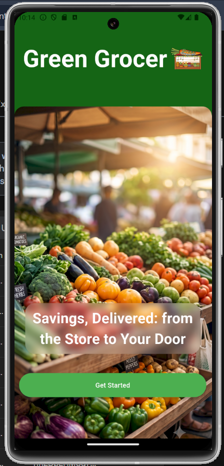
</p>

The Splash Screen serves as the entry point of the application. It introduces users to the platform and provides a **Get Started** button that navigates users to the authentication page.

---

## 2. Login Page

<p align="center">
  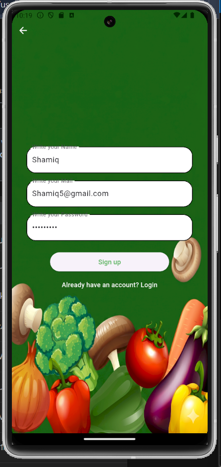
</p>

<p align="center">
  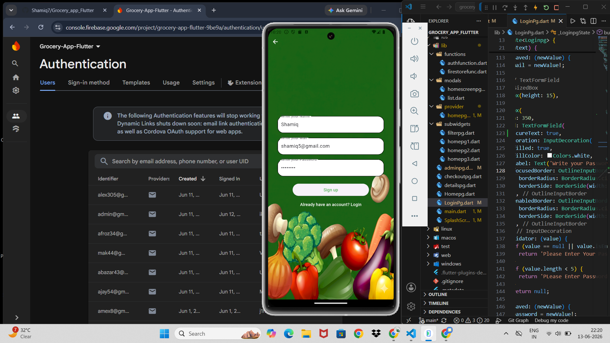
</p>

The Login Page allows users to enter their name, email address, and password.

Firebase Authentication is used to verify user credentials.

### User Access
- Regular users are redirected to the Home Page.
- Administrators are redirected to the Admin Dashboard.

The Firebase Console shown in the screenshots demonstrates authenticated users being successfully stored and managed through Firebase Authentication.

---

## 3. Home Page

<p align="center">
  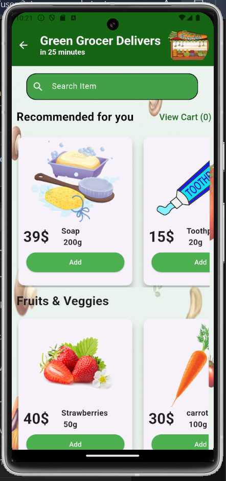
  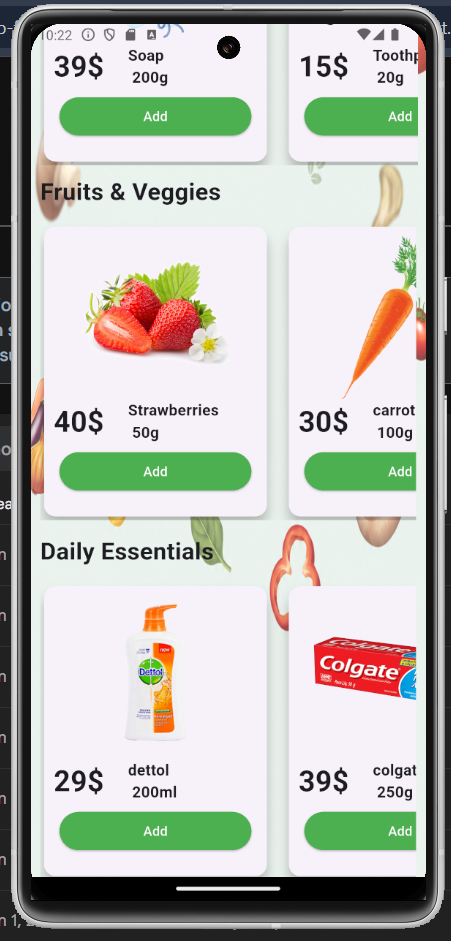
  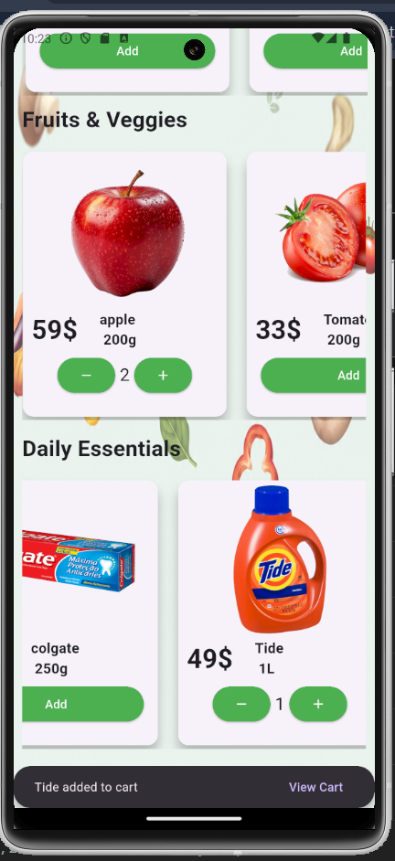
</p>

The Home Page serves as the primary shopping interface.

Products are organized into categories:

- Recommended Products
- Fruits & Vegetables
- Utilities

Users can:

- Browse products
- Add products to cart
- Navigate to Checkout
- Open Product Detail Pages

The application uses Provider to update quantities and cart information dynamically.

---

## 4. Product Search

<p align="center">
  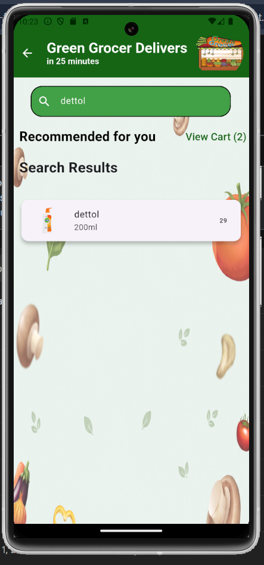
</p>

The Home Page includes a live search feature.

Users can search products by name, and matching products are displayed instantly. Selecting a product navigates the user directly to the Product Detail Page.

---

## 5. Product Details Page

<p align="center">
  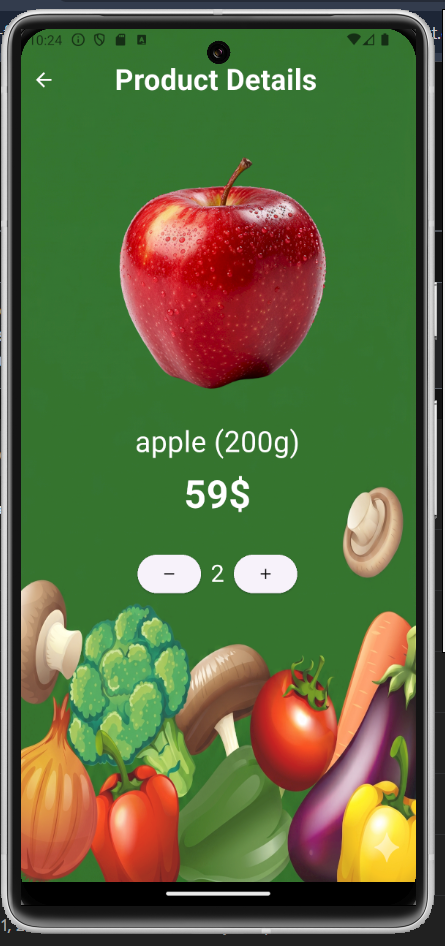
</p>

The Product Details Page provides detailed information about a selected product.

Displayed information includes:

- Product Image
- Product Name
- Product Price
- Product Weight

Users can:

- Add products to cart
- Increase quantity
- Decrease quantity
- Navigate directly to Checkout

---

## 6. Admin Dashboard

<p align="center">
  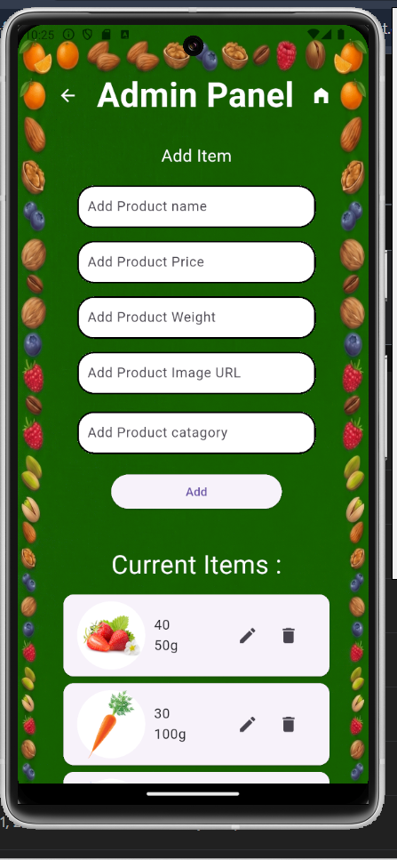
</p>

The Admin Dashboard is accessible only through administrator credentials.

Administrators can manage the complete product catalog through a dedicated interface.

### Available Operations

- Create Products
- Read Products
- Update Products
- Delete Products

All modifications are synchronized with Firestore and reflected throughout the application.

---

## 7. Product Creation

<p align="center">
  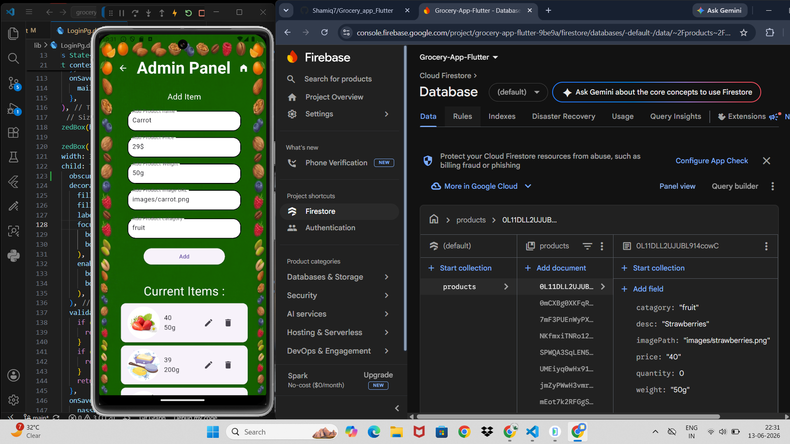
</p>

<p align="center">
  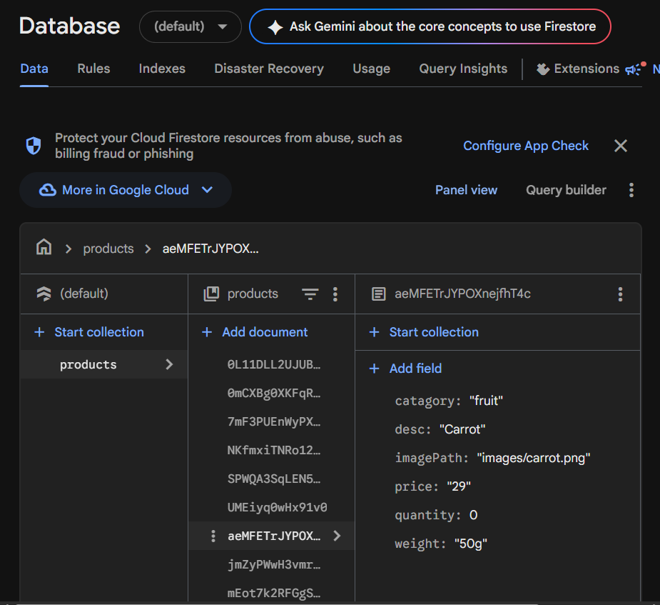
</p>

Administrators can create new products by entering:

- Product Name
- Product Price
- Product Weight
- Product Image Path
- Product Category

The screenshots demonstrate product information being entered through the Admin Dashboard and successfully stored in Cloud Firestore.

---

## 8. Product Update

<p align="center">
  
</p>

Administrators can modify existing product information using the Edit functionality.

Changes made through the update dialog are reflected in both:

- Cloud Firestore
- Application UI

This ensures product information remains synchronized across the application.

---

## 9. Checkout Page

<p align="center">
  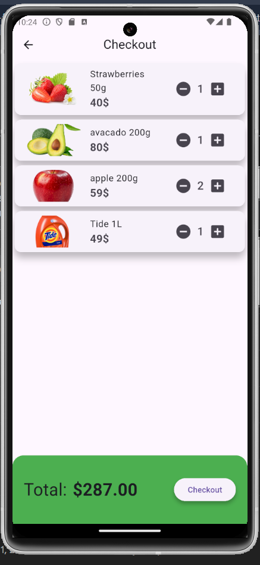
</p>

The Checkout Page displays all products added to the shopping cart.

### Features

- Product Quantity Display
- Product Pricing
- Dynamic Total Amount Calculation
- Checkout Button

Users can review their order before proceeding with the purchase process.

---

# 🔥 Firebase Features Used

### Firebase Authentication

Used for:

- User Registration
- User Login
- Role-Based Access
- User Management

### Cloud Firestore

Used for:

- Product Storage
- Product Retrieval
- Product Updates
- Product Deletion
- Dynamic UI Population

---

# 📂 Project Highlights

- Clean UI built using Flutter Widgets
- Provider-based State Management
- Firebase Authentication Integration
- Firestore CRUD Operations
- Dynamic Product Catalog
- Admin-Controlled Inventory Management
- Search Functionality
- Cart Management System
- Checkout Calculation Logic
- Category-Based Product Organization

---

# 🚀 Future Improvements

- Firebase Storage for Product Image Uploads
- Payment Gateway Integration
- Order History
- User Profiles
- Wishlist Functionality
- Product Ratings & Reviews
- Real-Time Inventory Tracking
- Push Notifications
- Dark Mode Support

---

# 👨‍💻 Author

Developed as a Flutter & Firebase learning project demonstrating:

- Authentication
- Firestore Integration
- CRUD Operations
- Provider State Management
- Shopping Cart Management
- Role-Based Access Control
- Dynamic Data Synchronization